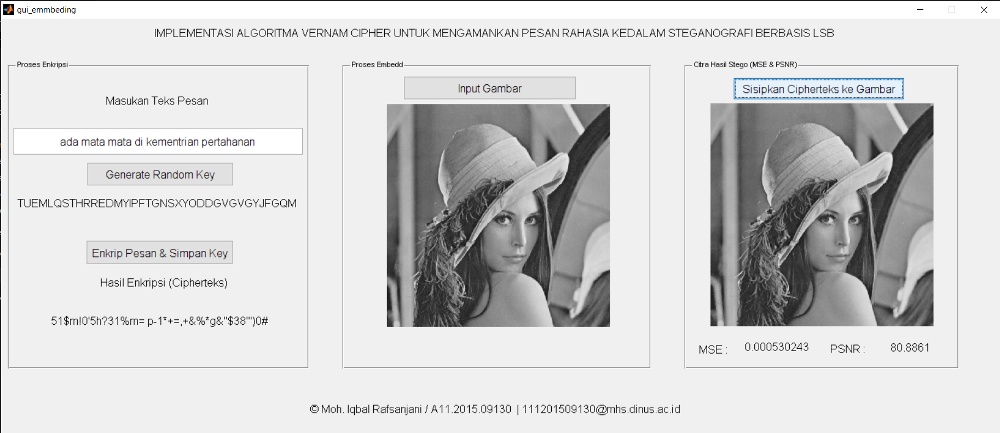
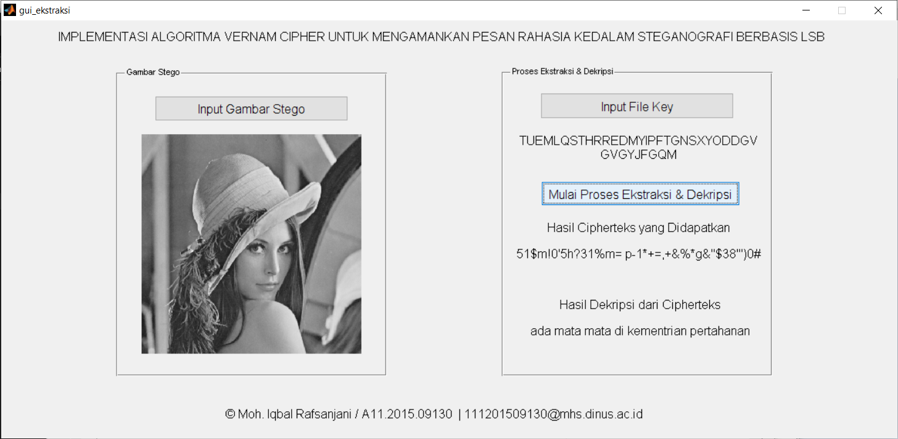

# FinalProject

<h3 align="center">Implementasi Algoritma Vernam Chiper Untuk Mengamankan Pesan Rahasia Ke Dalam Steganografi Berbasis LSB</h3>

# Hidden text to image 

# Extract text from image 

<h4 align="center">This final project finished in 2019-07-28 using MATLAB, this project created with high spirit and inspired from Edward Snowden on how somebody can seeing your activity without permission even in government level</h4>
